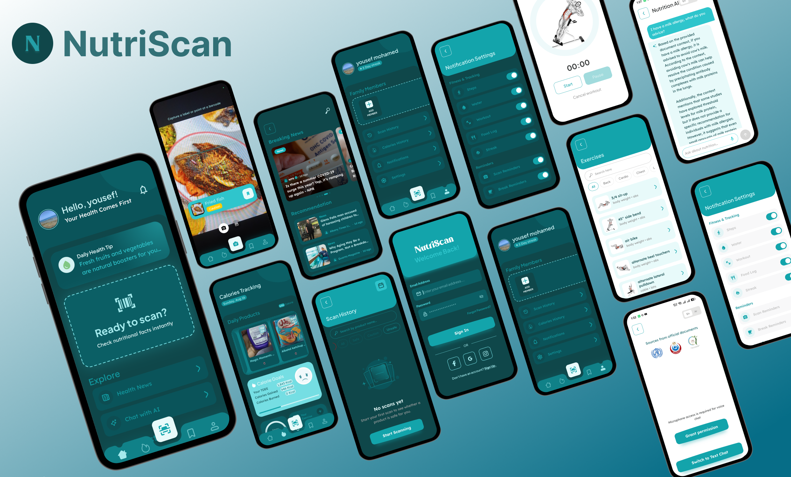

<div align="center">

# 🥦 NutriScan AI

### *Your AI-Powered Food Safety Guardian — Scan, Analyze, and Eat with Confidence*



[](https://android.com)
[](https://kotlinlang.org)
[](https://developer.android.com/jetpack/compose)
[](https://developer.android.com)
[](#)
[](#)

</div>

---

## 📖 Project Overview

**NutriScan AI** is a sophisticated, AI-powered Android health application engineered for the Egyptian and MENA market. It transforms the way individuals and families interact with food by using advanced AI and computer vision to instantly analyze food labels, barcodes, and grocery receipts — then cross-referencing the results against the user's personal health profile (medical conditions, allergies, and dietary restrictions) to deliver a clear, personalized **safety verdict** of 🟢 Safe, 🟡 Caution, or 🔴 Unsafe.

> **The Core Problem:** Millions of people with conditions like Celiac disease, diabetes, nut allergies, or hypertension must manually inspect every product label — a tedious, error-prone, and potentially dangerous process, especially in multilingual markets where Arabic product labels are common.

**NutriScan AI solves this by acting as a real-time, AI-driven dietitian in your pocket.** The app's backend is powered by a custom REST API coupled with **Gemini 2.5 Flash** (LLM) and a **Retrieval-Augmented Generation (RAG)** pipeline grounded in official Egyptian Organization for Standardization (EOS) and Ministry of Health (MOH) documents. This ensures that every verdict and every AI chat answer is grounded in authoritative, domain-specific sources — not hallucinations.

The app is fully **bilingual (Arabic/English)**, features a polished dark/light theme with a premium teal-and-dark design language, and is built on a strict **Clean Architecture + MVI** foundation for long-term scalability and correctness.

---

## ✨ Key Features

### 🔍 Core Scanning & AI Analysis
- **Unified Barcode + Photo Scan** — A single camera view runs ML Kit barcode detection simultaneously with image capture. A detected barcode appears as a tappable chip; a shutter tap submits a photo. Two scan modes: Photo and Gallery.
- **Real-Time AR Barcode Overlay** — Spring-animated bounding-box tracking locks onto a barcode in real time, visually frames it, and auto-submits after 1.5 seconds of stability.
- **AI-Powered Safety Verdict** — Every scan returns a personalized 🔴 Red / 🟡 Yellow / 🟢 Green verdict with a full explanation of which ingredients triggered the flag.
- **Detailed Product Details Screen** — Full nutritional breakdown (calories, serving, sugar, fat, saturated fat), flagged ingredients with allergy/condition reasons, and horizontal macro badges.
- **OpenFoodFacts Integration** — Real-time product data enrichment from the OpenFoodFacts public API.

### 👨‍👩‍👧 Family Health Management
- **Multi-Profile Support** — Manage health profiles for the entire household. Each family member's conditions and allergies are evaluated independently per scan.
- **Family Member CRUD** — A polished bottom sheet to add, edit, and remove family members with offline-first Room persistence and backend sync.
- **Profile Picture Upload** — Real multipart image upload to the server; avatar URL is the single source of truth and loaded via Coil.

### 🍽️ Calorie & Daily Tracking Dashboard
- **Daily Calorie Tracker** — Live calorie goal vs. consumed totals, computed from a real Room-backed food log synced with the backend.
- **Food Log (Offline-First)** — Add food from the Saved catalog via a swipe gesture; remove with a confirmation-gated delete button; data persists offline and syncs when connected.
- **Calorie History Screen** — Scrollable history of daily summaries (meals, water, steps, exercise) with dark glassmorphism card styling.
- **Water Tracker with Animated Fill** — Animated bottom-to-top cup fill with cascade staggering when jumping to cup N directly.
- **Calorie Goals Pager** — Paginated card for tracking body metrics and calorie goals.

### 🏋️ Exercises & Workouts
- **Exercise List** — Searchable exercise catalog with category chip filters (Cardio / Normal Workout).
- **Workout Screen** — Timer-based workout logger with Start/Pause/Restart/Cancel; editable Sets/Reps for strength exercises.
- **Calorie Burn Calculation** — Burnt kcal computed on workout completion and fed back into the Calories dashboard.

### 👟 Step Tracking
- **Live Step Counter** — Real-time step count via Android's hardware step sensor, hosted in a foreground Service (`START_STICKY`) for continuous background tracking.
- **Step History Screen** — Circular gauge with daily insight + a bar chart of monthly step history with period filters (Week / Month / 3 Months / 6 Months) and bottom stat cards (Calories, Distance, Active Minutes).

### 🤖 NutriGPT — AI Nutrition Assistant
- **Text Chat** — A full chat interface (teal bubble UX) backed by the RAG pipeline. Every message includes the user's full health profile; answers are grounded in MOH/EOS documents and never contradict the scan verdict.
- **Source Cards** — Expandable source document cards with file name, relevance score (%), and a snippet preview — full transparency into what the AI cited.
- **Voice Chat Mode** — A dedicated voice screen with waveform animation and TTS playback for hands-free nutrition Q&A.
- **Safety Disclaimer** — Automatically surfaces a localized disclaimer when documents lack sufficient information, preventing unsafe AI hallucinations.

### 📰 Health News Feed
- **Personalized Headlines** — Real-time health news via NewsAPI, filtered by the user's own medical conditions and allergies through chip selectors.
- **Keyword OR-Search** — Selecting multiple condition chips switches to a targeted multi-keyword news search.
- **In-App Reader** — Articles open in Chrome Custom Tabs with no context switching.

### 🔔 Smart Notification System
- **8 Notification Types** — Steps, Water, Workout, Food, News, Quote, Scan, and Streak — all schedulable via WorkManager `CoroutineWorker`.
- **Quiet Hours** — Configurable quiet-hours window (start/end time) persisted in DataStore.
- **Notification History Screen** — Locally persisted log of all dispatched notifications with swipe-to-delete and a "Clear All" action.
- **Notification Settings Screen** — Live "Today's Progress" with per-type toggles, fully themed for light and dark mode.

### 🛒 Saved Products & Scan History
- **Saved Products Catalog** — Save and manage products with a full-card swipe-to-add gesture.
- **Scan History with Smart Filters** — Chronological list of scans with failed/unsafe visual separation, autocomplete search, and Safety filter chips.
- **Delete Scan History** — Individual scan deletion with confirmation guard.

### ⚙️ Settings & Account Management
- **App Settings Screen** — Theme toggle (System/Light/Dark), Language toggle (English/Arabic), Terms & Conditions, Help, and Logout — all DataStore-persisted.
- **Edit Profile** — Full name, date of birth, height, weight, and profile picture editing.
- **Delete Account with Grace Period** — Account deletion with a 15-day grace period and an in-app Account Pending Deletion restoration screen.
- **Daily Streak** — Tracks consecutive days of app usage with streak recomputation logic.

### 🔐 Authentication
- **Email/Password Login & Registration** — Backed by Keycloak OIDC with access + refresh token lifecycle management.
- **Token Auto-Refresh** — OkHttp `Authenticator` transparently refreshes expired tokens; concurrent 401 calls are serialized with a synchronized block.
- **Secure Token Storage** — Tokens stored in `EncryptedSharedPreferences` (AES-256-GCM).
- **Onboarding Carousel** — Multi-page illustrated onboarding with health profile setup (conditions, allergies, family members, DOB, height, weight).

---

## 🛠️ Tech Stack & Architecture

### Architecture Overview

```
┌─────────────────── app ──────────────────────┐
│  @HiltAndroidApp · NavHost · DI Modules       │
└────────────┬──────────────────┬──────────────┘
             ▼                  ▼
     presentation             data
             │                  │
             └────────┬─────────┘
                      ▼
                   domain       ← Pure Kotlin · zero Android imports
```

The app is built on **Clean Architecture** with **MVI (Model-View-Intent)**:
- `StateFlow<FeatureState>` — screen state
- `sealed interface FeatureEvent` — user intents
- `Channel<FeatureEffect>(BUFFERED)` — one-shot side effects

### Core Language & UI

| Technology | Version | Role |
|---|---|---|
|  Kotlin | `2.2.0` | 100% Kotlin — zero Java |
|  Jetpack Compose | BOM `2026.02.01` | UI toolkit — zero XML layouts |
| Material 3 | via BOM | Design system components |

### Dependency Injection & Navigation

| Technology | Version | Role |
|---|---|---|
| **Hilt** | `2.59.2` | DI — the only allowed framework (Koin is banned) |
| **KSP** | `2.2.0-2.0.2` | Annotation processing (KAPT is banned) |
| **Navigation Compose** | `2.8.3` | Type-safe routing via `@Serializable` route objects |

### Networking

| Technology | Version | Role |
|---|---|---|
| **Retrofit 2** | `3.0.0` | REST API client — suspend-only |
| **OkHttp** | `5.4.0` | HTTP client; Auth, Error & Logging interceptors |
| **kotlinx.serialization** | `1.11.0` | JSON serialization (Gson/Moshi are banned) |
| **AppAuth** | `0.11.1` | OIDC/OAuth2 for Keycloak token management |

### Local Storage

| Technology | Version | Role |
|---|---|---|
| **Room** | `2.8.4` | Offline-first local database (source of truth) |
| **DataStore Preferences** | `1.1.1` | Settings: language, theme, notifications |
| **EncryptedSharedPreferences** | Security-Crypto | AES-256-GCM secure token storage |

### Camera & Vision

| Technology | Version | Role |
|---|---|---|
| **CameraX** | `1.4.2` | Live camera preview + image capture |
| **ML Kit Barcode Scanning** | `17.3.0` | On-device barcode/QR real-time detection |

### Async & Background Work

| Technology | Version | Role |
|---|---|---|
| **Kotlin Coroutines** | `1.8.1` | `viewModelScope`, `suspend`, `runCatchingCancellable` |
| **Kotlin Flow / StateFlow / Channel** | — | Reactive streams (RxJava is banned) |
| **WorkManager** | `2.10.0` | Background scheduling: notification workers, nightly sync |

### Images & Media

| Technology | Version | Role |
|---|---|---|
| **Coil 3** | `3.0.4` | Async image loading (`AsyncImage`) + GIF support |
| **Image Cropper** | `4.6.0` | Avatar crop before upload |

### Collections & State Stability

| Technology | Version | Role |
|---|---|---|
| **kotlinx-collections-immutable** | `0.3.8` | `ImmutableList`/`ImmutableMap` in UI State for stable Compose recomposition |

### Testing

| Technology | Version | Role |
|---|---|---|
| **JUnit 5** | `5.10.2` | Unit test runner |
| **MockK** | `1.13.10` | Mocking library (Mockito is banned) |
| **Turbine** | `1.1.0` | `StateFlow` + `Channel` stream assertions |
| **Kotlin Coroutines Test** | `1.8.1` | `runTest`, `TestCoroutineScheduler` |

### Firebase & Analytics

| Technology | Role |
|---|---|
| **Firebase Analytics** | Usage and event analytics |
| **Firebase App Distribution API** | QA build distribution to testers |

### Typography

| Font | Usage |
|---|---|
| **Plus Jakarta Sans** | Display, headline, and label roles (Latin locales) |
| **Lexend Deca** | Title and body roles (Latin locales) |
| **KOSans** | Arabic locale — auto-applied when locale is `ar` |

---

## 🌐 Ecosystem & Related Links

NutriScan AI is part of a broader multi-platform ecosystem:

| Resource | Link |
|---|---|
| 🔗 **Backend Repository** | [Link to Backend Repo](#) |
| 📱 **iOS App Repository** | [Link to iOS Repo](#) |
| 🎨 **UI/UX Design (Figma)** | [Link to Figma Design](https://www.figma.com/design/zs5EkmcWPyQJvwWY5awVQc/NutriScan) |

---

## 👥 The Team

NutriScan AI was built with passion by a core team of **3 talented engineers** as part of the ITI Graduation Project program.

| Name             | Role | Links |
|------------------|---|---|
| **Ahmed Tayser** |  Android Developer | [GitHub](https://github.com/soutAhmedTayseer) |
| **Ashraf Shrif** | Android Developer | [GitHub](https://github.com/Ashraf0Sherif) |
| **Nourelden**    | Android Developer | [GitHub](https://github.com/Noureldeen75)  |

---

## 🚀 Getting Started

### Prerequisites

| Requirement | Minimum Version |
|---|---|
| Android Studio | Ladybug (2024.2) or newer |
| JDK | 11+ |
| Android SDK | API 36 (target) / API 31 (minimum) |
| Gradle | 9.2.1 (via `gradlew` wrapper — no manual install needed) |

### 1. Clone the Repository

```bash
git clone https://github.com/yusefellban/NutriScan.git
cd NutriScan
```

### 2. Configure `local.properties`

Create (or update) `local.properties` at the project root. This file is **gitignored** — never commit it.

```properties
# Android SDK path (usually auto-generated by Android Studio)
sdk.dir=/path/to/your/android/sdk

# NutriScan Backend REST API
NUTRISCAN_BASE_URL=https://backend-url/api/v1/

# Keycloak Authentication Server
KEYCLOAK_BASE_URL=https://keycloak-url/

# Health News (NewsAPI.org)
NEWS_API_BASE_URL=https://newsapi.org/
NEWS_API_KEY=news_api_key_here

# Exercises API
EXERCISES_API_BASE_URL=https://exercises-api-url/

# NutriGPT AI Chat Backend
NUTRI_GPT_BASE_URL=https://nutrigpt-url/
```

### 3. Add `google-services.json`

Place your `google-services.json` (downloaded from the Firebase Console) inside the `app/` directory. If the file is absent, a dummy placeholder is auto-generated at build time to allow compilation — but Firebase Analytics and App Distribution will not function.

### 4. *(Optional)* Configure a Keystore for Signed Builds

Create `keystore.properties` at the project root:

```properties
storeFile=path/to/your/keystore.jks
storePassword=your_store_password
keyAlias=your_key_alias
keyPassword=your_key_password
```

### 5. Build & Run

**Debug APK:**
```bash
./gradlew assembleDebug
```

Install on a connected device or emulator:
```bash
adb install app/build/outputs/apk/debug/app-debug.apk
```

**Or simply press ▶️ Run in Android Studio** targeting any API 31+ device or emulator.

### 6. Run Tests

```bash
# All modules
./gradlew test

# Single module
./gradlew :presentation:test

# Single test class
./gradlew :presentation:test --tests "*.HomeViewModelTest"

# Lint check
./gradlew lint
```

---

## 📁 Module Structure

```
NutriScan/
├── app/           → @HiltAndroidApp, MainActivity, NavHost, all Hilt DI @Module bindings
├── domain/        → Pure Kotlin: UseCases, Repository interfaces, Domain models
├── data/          → RepoImpl, Room entities/DAOs, Retrofit services, DTOs, Interceptors
└── presentation/  → Compose Screens, ViewModels, State/Event/Effect, shared Components
```

Each module has its own `AGENTS.md` with detailed engineering contracts. The root `AGENTS.md` is the single authoritative source of truth for all architectural decisions.

---

<div align="center">

**Built with ❤️ for healthier, safer eating in Egypt and beyond.**


</div>
