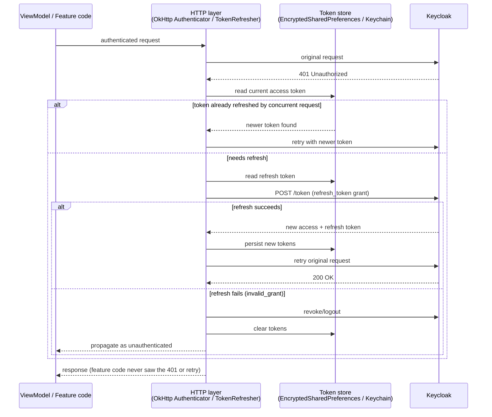
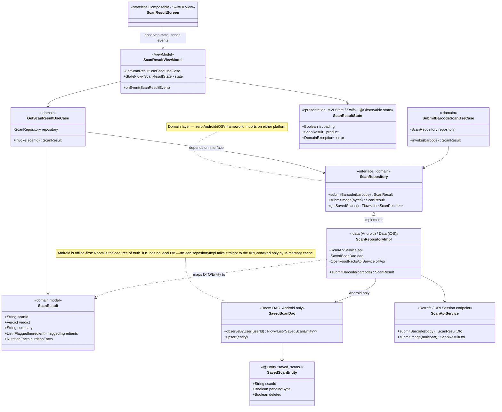
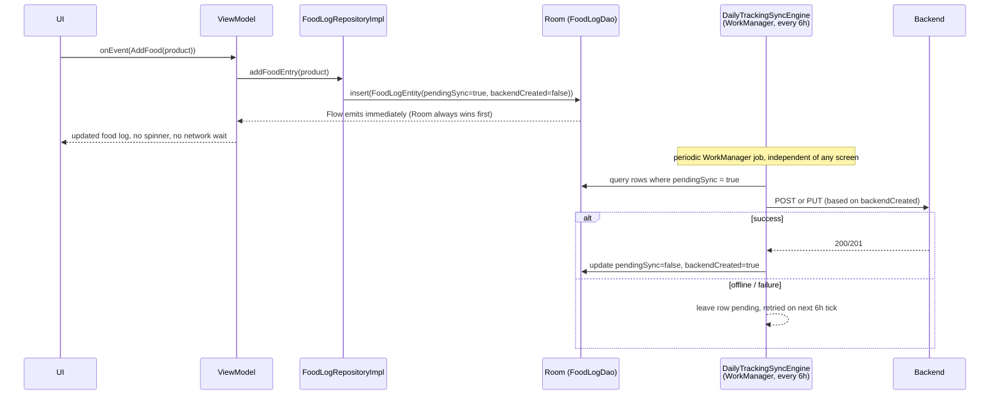

# NutriScan — Android ⇄ iOS Architecture & Engineering Comparison

> Companion engineering document to `README.md` and the graduation-project
> documentation PDF. Every Android claim below is verified against this
> repository (`domain/`, `data/`, `presentation/`, `app/`); every iOS claim is
> taken from the project documentation, since the iOS codebase lives in a
> separate repository. Where the two platforms differ, both columns are
> filled in side by side so the same capability can be traced across
> platforms.

---

## 1. Purpose

NutriScan ships as two independent native clients — Android (Kotlin /
Jetpack Compose) and iOS (Swift / SwiftUI) — against one shared REST
backend and one shared Keycloak identity realm (`nutriscan`). Both clients
implement the **same feature set** and the **same Clean Architecture
dependency rule** (`presentation → domain ← data`), but express it through
each platform's idiomatic patterns:

| | Android | iOS |
|---|---|---|
| Presentation pattern | MVI (`State` / `Event` / `Effect`) | MVVM (`@Observable` ViewModel + stateless `View`) |
| DI | Hilt (compile-time, KSP) | `DIContainer` (runtime service locator) + per-feature `Assembly` |
| Local persistence | Room (SQLite, source of truth, offline-first) | No local DB — in-memory cache + `UserDefaults`, backend is authoritative |
| Navigation | Compose Navigation, type-safe `@Serializable` routes | `AppRouter` + `Route`/`AnyRoute`, one `NavigationStack` per tab |
| Secure storage | `EncryptedSharedPreferences` (AES-256-GCM) via DataStore | iOS Keychain via `KeychainManager` |
| Reactive streams | `StateFlow` / `Channel` / `Flow` | `@Observable` properties + Swift Concurrency (`async`/`await`, `Task`) |

This document exists so a change made in one platform's architecture has an
obvious counterpart to check on the other.

---

## 2. Feature parity matrix

Every feature ships on both platforms. The "Android reference" column
points at the real module/class in this repo.

| Domain | Feature | Android reference | iOS reference |
|---|---|---|---|
| Onboarding & Auth | Splash → onboarding carousel → login/register/forgot-password → profile setup pager | `presentation/.../onboarding`, `auth`, `profilesetup` | `Splash`, `Onboarding`, `Auth`, `ProfileSetup` |
| Onboarding & Auth | Email/password + Google (via Keycloak IdP brokering), OIDC/PKCE via AppAuth | `NutriScanAuthenticator` (OkHttp `Authenticator`), `TokenManager` | `TokenRefresher`, `KeychainManager` |
| Onboarding & Auth | Account deletion with grace period + restoration | `DeleteAccountUseCase`, `RestoreAccountUseCase` | `AccountRestoration` feature, `.pendingDeletion` flow state |
| Scanning | Unified barcode + photo capture, single camera screen | CameraX + ML Kit Barcode Scanning | `AVCaptureSession` + `AVCaptureMetadataOutput` |
| Scanning | Barcode → `POST /v1/scans/barcode`, fallback to OpenFoodFacts | `GetProductByBarcodeUseCase`, `SubmitBarcodeScanUseCase` | `Scan` feature, same endpoint |
| Scanning | Photo → `POST /v1/scans` (multipart) | `SubmitScanImageUseCase` | `Scan` feature, `MultipartFormData` |
| Scanning | Verdict, flagged ingredients, nutrition facts | `GetScanResultUseCase`, `SavedScanEntity` (Room) | `ProductDetails` feature, in-memory only |
| Scanning | History with search/filters, saved/favourite scans | `GetRecentScansUseCase`, `GetSavedScansUseCase`, `SavedScanDao` | `ScanHistory`, `Favorites` |
| Tracking | Calorie dashboard, food log (add/remove w/ confirmation) | `ObserveTodayFoodLogUseCase`, `AddFoodEntryUseCase`, `FoodLogDao` | `Calories` feature |
| Tracking | Water tracking | `UpdateWaterCntUseCase`, `DailyTrackingDao` | `Calories` feature (shared screen) |
| Tracking | Step counting | Hardware step-counter sensor via `StepsForegroundService` (`FOREGROUND_SERVICE_HEALTH`) | `HealthKitStepDataSource` (+ `CMPedometer` fallback) |
| Tracking | Calorie/step history, streaks | `GetCaloriesHistoryUseCase`, `GetStepHistoryUseCase`, `ObserveStreakUseCase`, `StreakDao` | `CaloriesHistory`, `StepTracker` |
| Exercise | Catalogue, search, workout player, calorie burn on completion | `GetExercisesUseCase`, `MarkWorkoutDoneUseCase`, `ExerciseDao`/`WorkoutLogDao` | `Exercise` feature |
| Content | News feed filtered by conditions/allergies | `GetHealthHeadlinesUseCase`, `SearchNewsArticlesUseCase` | `News` feature |
| Assistant | NutriGPT text chat (RAG, `POST /api/query`), cited sources | `SendNutriGptMessageUseCase`, markdown rendering | `RAG` feature, `RAGChatViewModel` |
| Assistant | NutriGPT voice mode | `SpeechRecognizer` + `TextToSpeech`, behind `VoiceManager` domain interface, 1.5x playback | `RAGSpeechRecognizerService` (`SFSpeechRecognizer`) + `AVSpeechSynthesizer` |
| Profile | Edit profile, avatar upload, BMI/TDEE (server-computed) | `UpdateUserProfileUseCase`, `UploadAvatarUseCase` | `PersonalInformation`, `Profile` |
| Profile | Family members (own allergies/conditions each) | `AddFamilyMemberUseCase` — stored as JSON list on `users` row (Room) | Fetched from backend on demand, no local persistence |
| Settings | Theme (system/light/dark), language (EN/AR) | `SetThemeModeUseCase`, `SetLanguageUseCase` — DataStore | `Settings` feature — `UserDefaults` |
| Settings | Notifications: 8–9 types, quiet hours, history | 9 `@HiltWorker` WorkManager workers + `NotificationHistoryDao` | `SmartNotificationScheduler` + `SmartNotificationEvaluator`, local notification history |

---

## 3. Architecture side by side

### 3.1 Module / layer layout

```
Android (this repo, 4 Gradle modules)          iOS (feature-first, single app target)
──────────────────────────────────             ──────────────────────────────────
:app                                            NutriScan/
  Hilt DI graph, NavHost, WorkManager,            NutriScanApp.swift        (@main)
  steps foreground service                        RootCoordinatorView.swift
                                                    Core/
:presentation                                        Navigation/   (AppFlowCoordinator, AppRouter, Route)
  Compose screens, ViewModels,                       Network/      (NetworkService, TokenRefresher, NetworkMonitor)
  State / Event / Effect                             Security/     (KeychainManager)
                                                       Notifications/(SmartNotificationScheduler)
:domain          ← pure Kotlin, zero                 Shared Components/
                   Android imports                    SharedProfile/, TabBar/, DTOs/, Extensions/, Helpers/
  UseCases, Repository interfaces,               DI/                          (DIContainer, Assembly, AppDependencies)
  domain models                                  Features/<FeatureName>/      (22 features)
                                                    Domain/  (Entities, Repositories protocols, UseCases)
:data                                              Data/    (DTOs, Services, Repositories, Mappers)
  Room DAOs/entities, Retrofit services,           Presentation/ (View/, ViewModel/, Routing/, DI/)
  DTOs, interceptors, repository impls
```

Dependency rule on both platforms is **Presentation → Domain ← Data**;
`Domain` never imports a framework type (`Context`/`Uri`/Compose on
Android, `UIKit`/Combine on iOS).

### 3.2 Presentation contract

**Android — MVI**, one uniform triad per feature
(`presentation/<feature>/{state,viewmodel,view}`):

```kotlin
// State — everything the screen renders, one immutable data class
data class ScanResultState(
    val isLoading: Boolean = false,
    val product: Product? = null,
    val error: DomainException? = null,
)

// Event — the only way the UI talks to the ViewModel
sealed interface ScanResultEvent {
    data class AddToFoodLog(val product: Product) : ScanResultEvent
}

// Effect — one-shot side effects, delivered over a Channel(BUFFERED)
sealed interface ScanResultEffect {
    data object NavigateBack : ScanResultEffect
}

class ScanResultViewModel @Inject constructor(
    private val getScanResult: GetScanResultUseCase,
) : ViewModel() {
    private val _state = MutableStateFlow(ScanResultState())
    val state: StateFlow<ScanResultState> = _state.asStateFlow()

    private val _effect = Channel<ScanResultEffect>(Channel.BUFFERED)
    val effect = _effect.receiveAsFlow()

    fun onEvent(event: ScanResultEvent) { /* … */ }
}
```

**iOS — `@Observable` MVVM**, stateless `View` reading a reference-type
ViewModel directly (no Combine, no `@StateObject`):

```swift
@Observable
final class ScanResultViewModel {
    var uiState: ScanResultState = .idle
    var errorMessage: String?

    private let getScanResult: GetScanResultUseCase

    init(getScanResult: GetScanResultUseCase) {
        self.getScanResult = getScanResult
    }

    func handleAction(_ action: ScanResultAction) {
        Task {
            uiState = .loading
            do {
                let result = try await getScanResult.execute(action)
                await MainActor.run { uiState = .success(result) }
            } catch {
                await MainActor.run { errorMessage = error.localizedDescription }
            }
        }
    }
}
```

| Concern | Android | iOS |
|---|---|---|
| State container | `StateFlow<State>` | `@Observable` var properties on the ViewModel |
| User intent | `sealed interface Event` + single `onEvent()` | Action enum / method call on the ViewModel |
| One-shot effects | `Channel<Effect>(BUFFERED)` | Direct call into `AppRouter` / coordinator from the ViewModel |
| Async work | `viewModelScope.launch`, `suspend` | `Task { }`, `async`/`await` |
| Thread hop back to UI | Dispatchers.Main is implicit (Compose collects `StateFlow`) | Explicit `await MainActor.run { }` |
| Collection stability | `kotlinx.collections.immutable.ImmutableList` in state | Value-type (`struct`) state, no separate stability layer needed |

### 3.3 Dependency injection

| | Android | iOS |
|---|---|---|
| Mechanism | **Hilt** (compile-time, KSP-generated) | `DIContainer` — thread-safe runtime service locator |
| Registration unit | `@Module` / `@InstallIn` in `:app` | `Assembly` struct per feature, composed in `AppDependencies.setup()` |
| Failure mode | Compile error if a binding is missing | Runtime crash/force-unwrap if a service was never registered |
| Where composition happens | `app/di/*Module.kt` | `NutriScanApp.init()` → `AppDependencies.setup()` |

### 3.4 Navigation

| | Android | iOS |
|---|---|---|
| Top-level flow switch | `NavHost` reading auth/profile state at `:app` level | `RootCoordinatorView` + `AppFlowCoordinator` (`ObservableObject`) switching over `AppFlow` enum: `.splash → .onboarding → .auth → .profileSetup → .main` / `.pendingDeletion` |
| Routes | `@Serializable` Kotlin objects/data classes (type-safe Compose Navigation) | `Route` / `AnyRoute` enum per feature |
| Per-tab back stack | Single Compose `NavHost` back stack, bottom bar (5 tabs: Home, Calories, Scan, Exercises/News, Profile) | 5 tabs, each owning an **independent** `NavigationStack` via its own `AppRouter` |

### 3.5 Authentication & token refresh

Both platforms run the identical OIDC/PKCE flow against Keycloak realm
`nutriscan`, and both make token refresh *invisible to feature code* — but
they hook it at different layers:

- **Android**: `NutriScanAuthenticator` (`data/src/main/kotlin/.../remote/interceptor/NutriScanAuthenticator.kt`) is an OkHttp `Authenticator`. On a `401` it re-checks `TokenManager` inside a `synchronized` block (in case another concurrent request already refreshed), calls `TokenRefreshApiService.refreshToken()` via `runBlocking`, persists the new pair, and retries the original request. On `invalid_grant` it calls `logout()` and clears tokens.
- **iOS**: `TokenRefresher` sits above `NetworkService`. On `401` it exchanges the stored refresh token at the Keycloak endpoint, writes new tokens to Keychain via `KeychainManager`, and retries — same "feature code never sees the retry" guarantee, implemented with `async`/`await` instead of a blocking OkHttp interceptor thread.



---

## 4. Use case diagram

Feature set is identical on both platforms — one diagram, both clients as
alternate implementations of the same "Mobile Client" actor boundary.

```mermaid
graph TB
    User((Registered User))
    Family((Family Member))
    Backend[[NutriScan Backend]]
    Keycloak[[Keycloak]]
    OFF[[OpenFoodFacts]]
    News[[NewsAPI]]
    ExAPI[[Exercises API]]
    RAG[[NutriGPT / RAG Service]]

    subgraph Account
        UC1[Register / Verify Email]
        UC2[Login - Email or Google via Keycloak]
        UC3[Recover Password]
        UC4[Complete Health Profile]
        UC5[Manage Family Members]
        UC6[Delete / Restore Account]
    end

    subgraph Scanning
        UC7[Scan Barcode]
        UC8[Photograph Ingredient Panel]
        UC9[View Verdict + Flagged Ingredients]
        UC10[Browse / Search / Filter Scan History]
        UC11[Save / Favourite Scan]
    end

    subgraph Tracking
        UC12[Track Calories & Food Log]
        UC13[Track Water Intake]
        UC14[Track Steps]
        UC15[View Calorie/Step History]
        UC16[Maintain Streak]
    end

    subgraph Exercise
        UC17[Browse Exercise Catalogue]
        UC18[Log Workout]
    end

    subgraph "Content & Assistant"
        UC19[Read Nutrition News]
        UC20[Ask NutriGPT - Text or Voice]
    end

    subgraph Settings
        UC21[Configure Theme / Language]
        UC22[Configure Notifications]
    end

    User --> UC1 & UC2 & UC3 & UC4 & UC5 & UC6
    User --> UC7 & UC8 & UC9 & UC10 & UC11
    User --> UC12 & UC13 & UC14 & UC15 & UC16
    User --> UC17 & UC18
    User --> UC19 & UC20
    User --> UC21 & UC22
    Family -.evaluated within.-> UC5

    UC1 & UC2 & UC3 --> Keycloak
    UC7 --> Backend
    UC7 -.fallback.-> OFF
    UC8 --> Backend
    UC12 & UC13 & UC14 & UC15 & UC16 --> Backend
    UC17 --> ExAPI
    UC19 --> News
    UC20 --> RAG
```



---

## 5. Sequence diagram — the scan pipeline

Both entry points (barcode and photo) converge on the **same domain
result** so history, saved scans, and food logging never branch on capture
mode. Verdict computation is always server-side.

```mermaid
sequenceDiagram
    actor User
    participant Cam as Camera screen<br/>(CameraX + ML Kit / AVCaptureSession)
    participant VM as ScanViewModel / ScanResultViewModel
    participant UC as SubmitBarcodeScanUseCase /<br/>SubmitScanImageUseCase
    participant Repo as ScanRepository
    participant API as NutriScan Backend
    participant OFF as OpenFoodFacts
    participant Room as Room (SavedScanDao)<br/>[Android only]

    User->>Cam: point camera at product
    alt barcode detected
        Cam->>VM: onEvent(BarcodeDetected(code))
        VM->>UC: execute(barcode)
        UC->>Repo: submitBarcode(barcode)
        Repo->>API: POST /v1/scans/barcode
        alt backend has product
            API-->>Repo: ScanResult (verdict, ingredients, nutrition)
        else backend miss
            Repo->>OFF: GET /api/v2/product/{barcode}
            OFF-->>Repo: raw product data
            Repo-->>Repo: map to ScanResult (verdict pending/derived)
        end
    else shutter tapped
        Cam->>VM: onEvent(CapturePhoto(image))
        VM->>UC: execute(image)
        UC->>Repo: submitImage(multipart)
        Repo->>API: POST /v1/scans (multipart/form-data)
        API-->>Repo: ScanResult (verdict computed against user profile)
    end
    Repo-->>UC: ScanResult
    UC-->>VM: ScanResult
    VM->>VM: reduce → ScanResultState(product, verdict, ...)
    opt Android: user saves/favourites
        VM->>Room: upsert SavedScanEntity(pendingSync=true)
        Room-->>VM: Flow<SavedScanEntity> (Room emits first, always wins)
        Note over Room: DailyTrackingSyncEngine replays pendingSync rows<br/>to the backend every 6h via WorkManager
    end
    VM-->>User: verdict banner + flagged ingredients + nutrition facts
    opt add to food log
        User->>VM: onEvent(AddToFoodLog)
        VM->>Repo: addFoodEntry(product)
        Repo-->>Room: insert FoodLogEntity(pendingSync=true, backendCreated=false)
        Note over Repo: write never blocks on network — commits locally first
    end
```

---

## 6. Class diagram — Clean Architecture layering



---

## 7. Room database (Android) — the offline-first source of truth

iOS has **no local relational database**: it uses in-memory caching plus
`UserDefaults` for lightweight flags, and treats the backend as the sole
source of truth. Android's `NutriScanDatabase` (schema **version 17**,
`data/src/main/kotlin/iti/grad/nutriscan/data/db/NutriScanDatabase.kt`) is
the opposite design point — every screen reads from Room; the network only
refreshes it. This is the single biggest structural divergence between the
two clients and is why Android alone needs a background sync engine.

### 7.1 Entity-relationship diagram

`users` is the central entity. `daily_tracking`, `food_log`,
`saved_scans`, and `streak` are all keyed by `userId`. `diseases` and
`allergies` are reference catalogues, referenced by ID sets stored *inline*
on the user row rather than as join tables. `family_member` is
deliberately denormalised as a JSON list on `users` (no independent
lifecycle, never queried standalone, always loads with its owner) — a
direct structural difference from the backend's own `family_member` /
`family_member_allergy` tables, which the mobile client doesn't need to
mirror one-to-one.

```mermaid
erDiagram
    users ||--o{ daily_tracking : "has (userId)"
    users ||--o{ food_log : "has (userId)"
    users ||--o{ saved_scans : "has (userId)"
    users ||--|| streak : "has (userId)"
    exercise_categories ||--o{ exercises : "groups (category)"
    exercises ||--o{ workout_log : "logged as"

    users {
        string id PK
        string firstName
        string lastName
        string email
        string gender
        string dateOfBirth
        double heightCm
        double weightKg
        list_int diseaseIds
        list_int allergyIds
        string avatarUrl
        double bmi "server-computed"
        double tdee "server-computed"
        list_FamilyMemberEntity familyMembers "denormalised JSON"
        string updatedAt
    }

    daily_tracking {
        string userId PK_FK
        string date PK
        int targetWaterCnt
        int waterCnt
        int stepsCnt
        int caloriesBurnedSteps
        int exerciseKcal
        int exerciseMinutes
        boolean syncedToBackend
    }

    food_log {
        string id PK
        string userId FK
        string productId
        string name
        int calories
        string imageUrl
        string verdict
        string loggedDate
        long addedAtEpochMillis
        boolean pendingSync
        boolean deleted "soft-delete tombstone"
        int mealCnt
        boolean backendCreated
    }

    saved_scans {
        string scanId PK
        string userId FK
        string scannedAt
        string imageUrl
        string verdict "SAFE / CAUTION / UNSAFE"
        string status "COMPLETED / FAILED / PROCESSING"
        string summary
        string productName
        string flaggedIngredientsJson
        string nutritionFactsJson
        boolean pendingSync
        boolean deleted
    }

    streak {
        string userId PK
        int currentStreak
    }

    diseases {
        int id PK
        string name
        string description
    }

    allergies {
        int id PK
        string name
        string description
    }

    exercise_categories {
        string name PK
    }

    exercises {
        string id PK
        string name
        string category FK
        string bodyPart
        string equipment
        string target
        list_string secondaryMuscles
        map instructions
        map instructionSteps
        string imageUrl
        string gifUrl
        double repKcal
        double minKcal
    }

    workout_log {
        string date PK
        boolean done
    }

    notification_history {
        long id PK
        string title
        string body
        string type
        long timestamp
        boolean isRead
    }
```

Eleven `@Entity`-annotated tables total (`data/src/main/kotlin/iti/grad/nutriscan/data/db/entity/`):
`UserEntity`, `DiseaseEntity`, `AllergyEntity`, `DailyTrackingEntity`,
`FoodLogEntity`, `SavedScanEntity`, `ExerciseEntity`,
`ExerciseCategoryEntity`, `WorkoutLogEntity`, `StreakEntity`,
`NotificationHistoryEntity` — matching the eleven tables the graduation
documentation describes.

### 7.2 Offline-write pattern — sync flags, not blocking calls

`FoodLogEntity` and `SavedScanEntity` both carry the same three-flag
tombstone pattern instead of ever blocking a write on network availability:

| Flag | Meaning |
|---|---|
| `pendingSync` | A POST/PUT/DELETE to the backend is still owed for this row. |
| `deleted` | Soft-delete tombstone — the user removed it locally; kept out of `observeBy…` query results until the backend DELETE is confirmed, then physically removed. |
| `backendCreated` (food log only) | The initial POST already succeeded, so a queued follow-up sync should replay as PUT, not POST — this is what lets an offline create-then-delete collapse into zero server calls instead of racing a POST against a DELETE. |



Every repository call — Android-wide, not just food log — is wrapped in
`runCatchingCancellable` and dispatched on an injected `@IoDispatcher`
(reference implementation: `data/repository/FoodLogRepositoryImpl.kt`,
called out in this repo's `AGENTS.md` as the pattern new repositories
should copy), converting throwables into typed `DomainException`s while
still propagating coroutine cancellation correctly.

---

## 8. Testing

| | Android | iOS |
|---|---|---|
| Framework | JUnit 5 | XCTest + XCUITest |
| Mocking | MockK | manual fakes / protocol stubs |
| Async stream assertions | Turbine (`StateFlow`/`Channel`) | n/a — `@Observable` state read synchronously in tests |
| File count | 98 test files across all 4 modules | unit tests for business logic, mapping, validators, repositories; `NutriScanUITests` for navigation flows |
| Hardware-dependent features | tested manually (camera, sensors) | tested manually (camera, HealthKit, motion, microphone, speech) |
| House rule | Every `*ViewModel.kt` change requires a matching `*ViewModelTest.kt` update (this repo's `AGENTS.md` §11.2) | — |

---

## 9. Where the platforms genuinely diverge

Not everything should — or does — mirror 1:1. These are deliberate,
platform-appropriate divergences rather than gaps:

1. **Local persistence.** Android is offline-first with Room as the
   source of truth and a background sync engine; iOS treats the backend
   as authoritative and re-fetches, trading offline availability for a
   simpler client. This is the single largest architectural difference
   between the two clients (§7).
2. **DI mechanism.** Hilt catches a missing binding at compile time;
   `DIContainer` catches it at runtime. This is an explicit engineering
   trade-off in the iOS design, not an oversight.
3. **Effect delivery.** Android routes one-shot side effects through a
   typed `Channel<Effect>`; iOS lets the ViewModel call the coordinator/router
   directly. Both guarantee "exactly once," expressed differently because
   Swift Concurrency doesn't need a broadcast-channel primitive for this.
4. **Step tracking source.** Android reads the raw hardware step-counter
   sensor via a `FOREGROUND_SERVICE_HEALTH` service (no OS-level
   aggregator to lean on); iOS gets step history for free from HealthKit
   and falls back to `CMPedometer` only for live counts when HealthKit is
   unavailable.

---

## 10. References

- This repo's `AGENTS.md` (root, `data/`, `domain/`, `presentation/`) — authoritative Android engineering contract.
- `NutriScan_Complete_Documentation_Restructured copy.pdf` — graduation-project documentation (source for all iOS-side claims in this file).
- Android source: https://github.com/yusefellban/NutriScan
- iOS source: https://github.com/OTech-Company/NutriScan
- Backend source: https://github.com/ReemMohy259/NutriScan-AI
